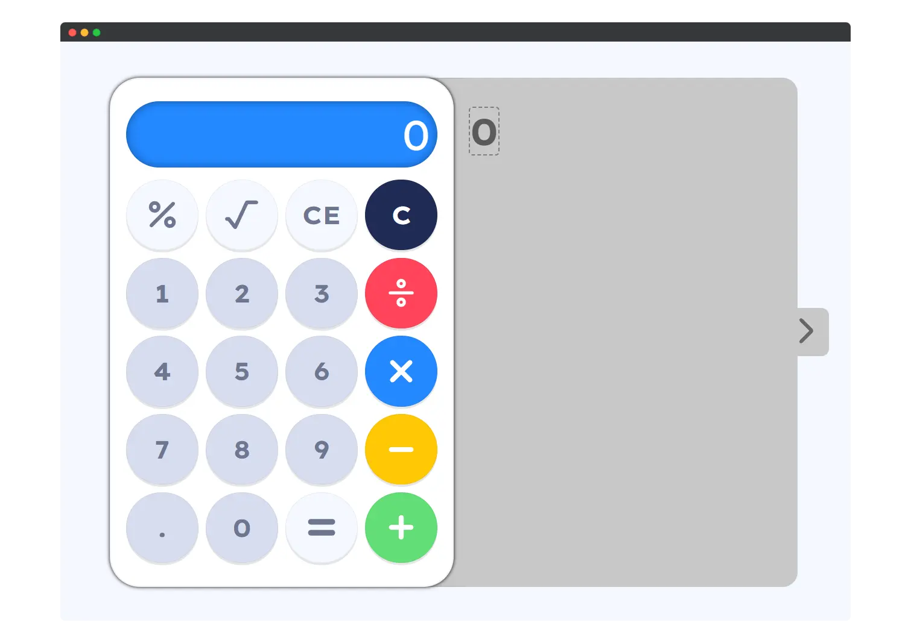

# vanilla-calculator

## Modern Web Vanilla Calculator

[](https://opensource.org/licenses/MIT)

A sleek, responsive, and feature-rich calculator built entirely with HTML, CSS, and vanilla JavaScript. This project goes beyond basic calculations to include a beautiful interface, a live operation history panel, keyboard support, and dynamic visual feedback.

<p align="center">
    
</p>
---

## Live Demo

Check out the live version of the calculator here: **[Live Demo Link](https://lepcodes.github.io/vanilla-calculator/)**

---

## Features

This calculator is packed with features designed for a great user experience:

* **Core Arithmetic:** All standard operations: Addition (`+`), Subtraction (`-`), Multiplication (`×`), and Division (`÷`).
* **Advanced Functions:** Includes Square Root (`√`) and Percentage (`%`) calculations.
* **Live Operation History:** A scrollable panel displays your full calculation history in real-time, making it easy to track complex operations.
* **Fully Responsive Design:** The interface seamlessly adapts from wide desktop screens to mobile devices, with a layout that shifts intelligently for smaller viewports.
* **Dual Input Support:** Works perfectly with both mouse clicks and keyboard input.
    * **Numbers:** `0-9`
    * **Operators:** `+`, `-`, `*`, `/`
    * **Equals:** `Enter`
    * **Clear Entry (CE):** `Backspace`
* **Dynamic Visual Feedback:**
    * Buttons provide a tactile "press down" effect.
    * A "shine" animation on the display and history panel highlights when a result is calculated.
* **Modern UI/UX:** A clean, visually appealing design featuring:
    * Google Fonts (Lexend Exa).
    * Color-coded operator keys for easy identification.
    * Smooth transitions and a stylish custom scrollbar.
* **Zero Dependencies:** Built with pure, lightweight vanilla JavaScript. No frameworks or libraries needed.

---

## Getting Started

To run this project on your local machine, simply follow these steps.

### Prerequisites

All you need is a modern web browser that supports HTML5, CSS3, and JavaScript (ES6).

### Installation

1.  Clone the repository to your local machine:
    ```sh
    git clone [https://github.com/your-username/your-repo-name.git](https://github.com/your-username/your-repo-name.git)
    ```
2.  Navigate to the project directory:
    ```sh
    cd your-repo-name
    ```
3.  Open the `index.html` file in your browser. That's it!